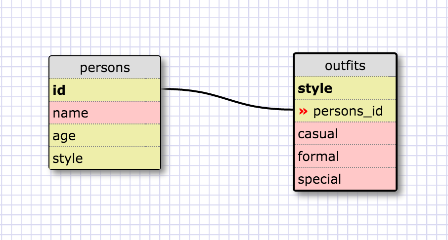

## 8.4 Challenge Release 5:
 
1.
SELECT * FROM states;
 
2.
SELECT * FROM regions;
 
3.
SELECT state_name,population
FROM states;
 
4.
SELECT state_name,population
FROM states
ORDER BY population DESC;
 
5.
SELECT state_name
FROM states
WHERE region_id=7;
 
6.
SELECT state_name
FROM states
WHERE population_density>50
ORDER BY population_density ASC;
 
7.
SELECT state_name
FROM states
WHERE population BETWEEN 1000000 AND 1500000;
 
8.
SELECT state_name,region_id
FROM states
ORDER BY region_id ASC;
 
9.
SELECT region_name
FROM regions
WHERE region_name LIKE "#Central%";
 
10.
SELECT region_name,state_name
FROM regions,states
ORDER BY region_id ASC;
  

##Release 6:  

  

##Release 7:  
<b>What are databases for?</b> 
Databases are using to store data in a more structured way like a table, to easily search and access data. 
<b>What is a one-to-many relationship?</b> 
It is when two different objects share a relationship where the first object belongs to the second object. The second object also has many types of first object. 
<b>What is a primary key? What is a foreign key? How can you determine which is which?</b> 
A primary key is a table column containing unique values in a relational database. On the relational database will be the same key, this is the foreign key that is referenced by the primary key. This will hold additional information based on the foreign key. 
<b>How can you select information out of a SQL database? What are some general guidelines for that?</b> 
Use the SELECT command to send a query FROM the table of choice, this is return a result set in the form of a table.  For example: SELECT column_name FROM table_name; 