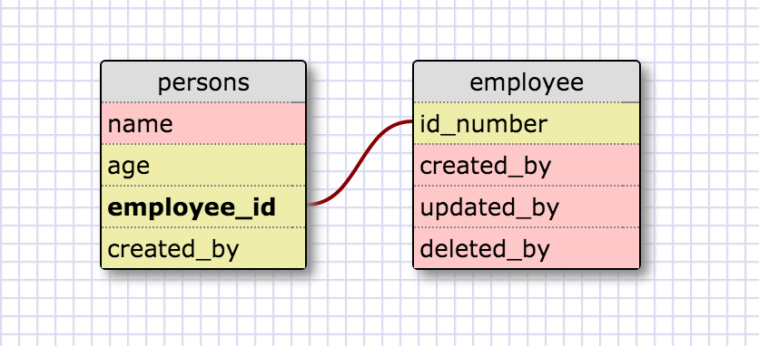
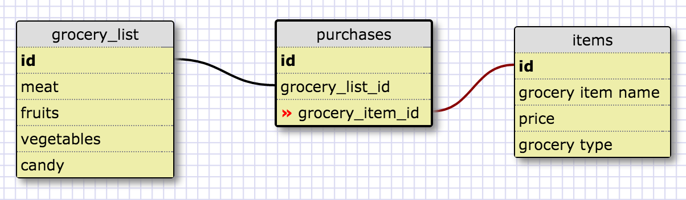

##Screenshots:

##Reflection
  
<b>What is a one-to-one database?</b> 
One to one database is a type of database relationship where one data item, such as id numbers, are associated with one data item in another database.
<b>When would you use a one-to-one database? (Think generally, not in terms of the example you created).</b> 
You would use a one to one database when there is only one possible relationship to the other.
<b>What is a many-to-many database?</b> 
Many to many database the a relationship between many pieces of data that be associated with other groups of data.
<b>When would you use a many-to-many database? (Think generally, not in terms of the example you created).</b> 
When you would want access many different points of data that are related.
<b>What is confusing about database schemas? What makes sense?</b> 
Going from a blank slate to creating how many different table sets needed, and keeping all of those different table sets orderly will be confusing.